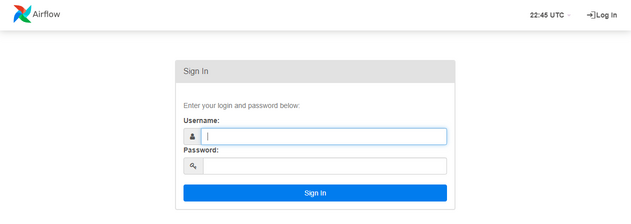
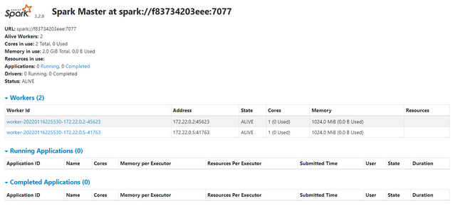
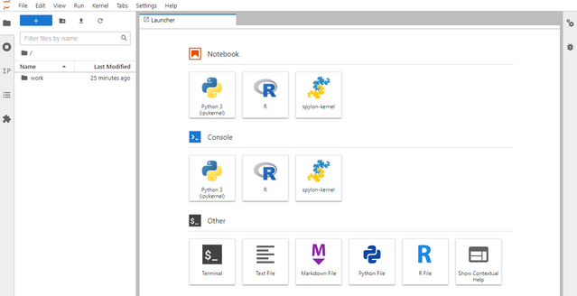

# Training Data Platform Engineer
This repository contains projects and images to assist an entry-level developer in transitioning into a data platform engineer. The goal of a Data Platform Engineer is to architect and build cloud-native data pipelines and infrastructure for big data analytics and end-to-end machine learning projects.

# Setup Instruction
- [docker README and setup guide](docker/README.md)
- [Airflow README and setup guide](airflow/README.md)
- [Spark README and setup guide](spark/README.md)
- [dbt README and setup guide](spark/README.md)

# Training Modules
- DevOps fundamentals with docker
  - Install docker and docker-compose
  - use docker-compose to build a containerized service
- Airflow
  - Setting up airflow with docker
  - Writing your first dags
- Spark
  - Working with spark and jupyter lab 
  - Write a scala/python app to read from a s3 bucket
- Kafka
  - Build a Kafka services to produce/consume events
  - Kafka connect
  - processing events with KSQL stream
- DBT
  - To spin up the dbt only, use `docker-compose up --build -d dbt`, following `docker exec -it base-data-platform-stack_dbt_1 bash` to entre the environment
  - Getting started with DBT
  - Using DBT with Airflow
- End-to-end ML project capstone
  - EDA with Jupyter Lab
  - How to process & run ML project, the big data style  
  - Build an end-to-end ML project with BigQuery ML

# Screenshot & URLs
Airflow UI http://localhost:8080/

Spark UI http://localhost:8082/

Jupyter Lab http://localhost:8888/

